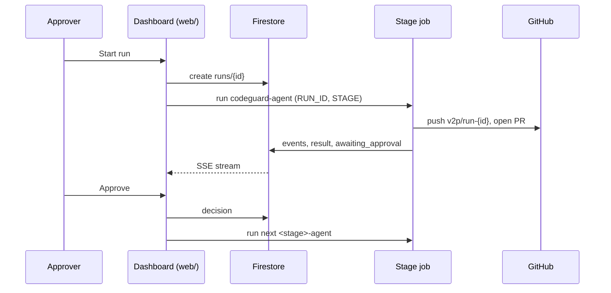

# Vibe2Prod

Vibe2Prod takes a vibe-coded web app (the kind AI Studio generates: Express + Vite React, calling Gemini) from a GitHub repo and prepares it for production on Google Cloud. Four ADK agents run in sequence: CodeGuard fixes security problems in the code, Architect writes a design doc, IaC writes Terraform with a cost estimate, and Deploy builds and deploys the app and scores production readiness. A person approves or denies each stage in a dashboard before the next one starts. Built for GCC VibeLift 2026.

## Status

| Component | State |
|---|---|
| CodeGuard (`agents/codeguard`) | Cloud Run Job `codeguard-agent`; has completed a run as a job |
| Architect (`agents/architect`) | Tested locally; job `architect-agent` deployed by Cloud Build |
| IaC (`agents/iac`) | Tested locally end to end; Cloud Run Job `iac-agent`. Support for app code changes from the design is still being finished |
| Deploy (`agents/deploy`) | Tested locally end to end; Cloud Run Job `deploy-agent` |
| Hello (`agents/hello`) | Cloud Run Job `hello-agent` (smoke test) |
| Dashboard (`web/`) | Runs locally, not deployed |
| Platform Terraform (`infra/`) | Empty; platform resources were created with gcloud |

## How a run works

1. A project is a Firestore doc in `projects/{id}` that names the app repo, base branch and optional subfolder (`path`). Projects are created by hand; the dashboard has no create-project form.
2. Someone with an approver key clicks Start run on the project page. The API creates `runs/{project}-{n}` in a transaction (one active run per project), then starts the Cloud Run Job `codeguard-agent` with `RUN_ID` and `STAGE` env overrides.
3. Each stage is one Cloud Run Job execution. The job loads the run doc, checks out the repo, runs its ADK workflow, and writes every model thought, tool call, tool result and output to `runs/{id}/events/{seq}`. The dashboard streams these events to the browser over SSE.
4. When the stage finishes, the job sets the stage and run status to `awaiting_approval`, records a summary, artifacts (PR, design doc, Terraform, cost, live URL, audit report) and a structured `result`, then exits. On any error the stage and run are marked `failed`.
5. The approver reviews and clicks Approve or Deny. Deny requires a reason, ends the run and marks later stages `skipped`. Approve records the decision in `runs/{id}/decisions` and starts `<next-stage>-agent`. Approving the last stage marks the run `succeeded`.

Stage order: `codeguard` -> `architect` -> `iac` -> `deploy`. The approval after IaC is the go/no-go for `terraform apply`: Deploy only runs once the Terraform and cost estimate are approved.

Handoff between stages:

- Git: all stages work on the branch `v2p/run-<run_id>` in the app repo. CodeGuard creates it and opens the single PR for the run. Architect commits `<app>/docs/DESIGN.md`, IaC commits `<app>/infra/*.tf` (and app code changes the design requires). Deploy pushes nothing. The PR collects every change.
- Firestore: each stage stores structured output in `runs/{id}.stages.<stage>.result`. Architect's result (resources, IAM, secrets, env vars, usage assumptions) is IaC's input; IaC's result (backend, image variable, plan summary, cost) is Deploy's input.



## Directory structure

```
.
├── cloudbuild.yaml          Builds the agents image and deploys the agent jobs on push to main
├── agents/                  All agents, one Docker image, one Cloud Run Job per agent
│   ├── Dockerfile           Python 3.12 image with git, node/npm, gitleaks, osv-scanner, hadolint, semgrep, terraform and pre-fetched providers
│   ├── requirements.txt     google-adk, aiohttp, Firestore, Cloud Billing client, requests
│   ├── main.py              Entrypoint: imports <AGENT>.agent and runs its main()
│   ├── common/              Shared code for stage agents (run context, events, guardrails, model, git/GitHub, stage lifecycle)
│   ├── hello/               Smoke-test agent: checks the job can call Gemini and run a tool
│   ├── codeguard/           Stage 1: scanners plus Gemini fixes, opens the run PR
│   ├── architect/           Stage 2: design doc writer and critic
│   ├── iac/                 Stage 3: Terraform writer, validation and policy checks, cost estimate
│   └── deploy/              Stage 4: image build, plan gate, apply, probe, readiness audit (with tests/)
├── web/                     Dashboard: React frontend and FastAPI backend in one container
│   ├── Dockerfile           Builds the frontend with node:22-slim, serves it from the Python API image
│   ├── api/main.py          REST + SSE API over Firestore; starts stage jobs
│   └── frontend/            React 19 + Vite + TypeScript, plain CSS
├── infra/                   Reserved for platform Terraform; empty
└── flawed/                  Deliberately insecure sample app used as agent test input
```

## Agents

| Stage | Folder | Cloud Run Job | What it does | Reads | Writes | Status |
|---|---|---|---|---|---|---|
| 1 | `agents/codeguard` | `codeguard-agent` | Runs gitleaks, semgrep, osv-scanner and hadolint; Gemini fixes the code; rescans | App repo at the base branch | Run branch, PR, findings before/after | Deployed |
| 2 | `agents/architect` | `architect-agent` | Writer drafts a design doc, an independent critic reviews it against the code, up to 3 rounds | Run branch, CodeGuard summary | `<app>/docs/DESIGN.md`, structured design | Tested locally |
| 3 | `agents/iac` | `iac-agent` | Writes Terraform for the design, validates and plans it against platform policy, prices it with Cloud Billing Catalog list prices | Architect result | `<app>/infra/*.tf`, plan summary, monthly cost | Tested locally, deployed |
| 4 | `agents/deploy` | `deploy-agent` | Builds the image with Cloud Build, gates the plan, applies it, probes the live app, scores readiness 0-100 | IaC result, run branch | Live Cloud Run service, readiness score, audit report | Tested locally, deployed |

See [agents/README.md](agents/README.md) for each agent's workflow, the shared code and how to run a stage locally.

The dashboard starts jobs named `<stage>-agent`.

## Dashboard

`web/` is a single Cloud Run service image: FastAPI serves `/api/*` and the built React app. The browser never talks to Firestore; the API reads Firestore and relays run and event changes over SSE. Writes (start run, approve, deny) require the `X-Approver-Key` header, matched against per-person keys from the `APPROVER_KEYS` env var (JSON object of email to key, intended to come from Secret Manager secret `dashboard-approver-keys`). The dashboard is not deployed yet. See [web/README.md](web/README.md).

## GCP setup

| Item | Value |
|---|---|
| Project | `vibe2prod-509620`, region `us-central1` |
| Gemini | `gemini-3.8-flash` via Vertex AI, location `global`, thinking level HIGH |
| Firestore | `(default)` database, platform only. Collections: `projects`, `runs`, `runs/{id}/events`, `runs/{id}/decisions` |
| Artifact Registry | Repo `vibe2prod` in `us-central1`: `agents:<commit-sha>` (platform) and `app-<run_id>:<commit>` (deployed apps) |
| CI/CD | Developer Connect connection `vibe2prod-github`; Cloud Build trigger `vibe2prod-main-push` runs `cloudbuild.yaml` on push to `main` as `vibe2prod-build@` |
| Agent jobs | Deployed with `gcloud beta run jobs deploy --functional-type=agent --identity-type=agent-identity`, so each job gets its own Agent Identity and is registered in Agent Registry. Service account `vibe2prod-agent-runtime` |
| App image builds | Deploy stage submits Cloud Build jobs as `vibe2prod-app-build@`, with source in `gs://vibe2prod-509620_cloudbuild` |
| GitHub token | Secret Manager `github-agent-token` (fine-grained, repo-scoped). Read at runtime by each agent job's own identity; never written to disk |
| Dashboard identity | Service account `vibe2prod-dashboard` |
| Terraform state | `gs://vibe2prod-509620-tfstate`, prefix `apps/<run_id>` |
| Deployed apps | Every resource named `app-<run_id>` (bucket `app-<run_id>-<project>`), labeled `v2p-run=<run_id>`, in the same project. Own Firestore database per app. Every app runs as the shared service account `vibe2prod-app-runtime` (has `aiplatform.user`; the deploy agent may act only as this account) |

Agent Identity tokens are certificate-bound, so Google API calls from agent jobs must use mTLS endpoints:

- Gemini: `aiohttp` must stay in `agents/requirements.txt`; google-genai only uses mTLS on its aiohttp path, and without it Vertex AI returns 401.
- Firestore: always create the client with `common.context.db()`, which switches to `firestore.mtls.googleapis.com` when a client certificate is present. A plain `firestore.AsyncClient()` fails under Agent Identity.
- Other REST calls (Secret Manager, Cloud Build, Cloud Run, Storage, Logging): `AuthorizedSession.configure_mtls_channel()` and the `*.mtls.googleapis.com` host, as in `common/repo.py` and `deploy/gcp.py`.
- Terraform uses its own credentials from the metadata server and works under Agent Identity without changes.

## Build and deploy

A push to `main` triggers Cloud Build, which:

1. Builds `agents/` into `us-central1-docker.pkg.dev/$PROJECT_ID/vibe2prod/agents:$COMMIT_SHA`.
2. Pushes the image.
3. Deploys from that image, all with `--max-retries=0`:

| Job | Env | Resources | Timeout |
|---|---|---|---|
| `hello-agent` | `AGENT=hello` | default | 10 min |
| `codeguard-agent` | `AGENT=codeguard`, `STAGE=codeguard` | 2 CPU, 4 GiB | 130 min |
| `architect-agent` | `AGENT=architect`, `STAGE=architect` | 2 CPU, 4 GiB | 130 min |
| `iac-agent` | `AGENT=iac`, `STAGE=iac` | 2 CPU, 4 GiB | 130 min |
| `deploy-agent` | `AGENT=deploy`, `STAGE=deploy` | 2 CPU, 4 GiB | 130 min |

Each agent stops itself at `STAGE_TIMEOUT_S` (default 2 hours), before the job timeout. Cloud Build then builds the dashboard image and redeploys `vibe2prod-dashboard`.

Run a deployed job by hand (the run doc `runs/<run_id>` must exist and the earlier stages' results must be in it):

```
gcloud run jobs execute codeguard-agent --region=us-central1 \
  --update-env-vars=RUN_ID=<run_id>,STAGE=codeguard
```

## Local development

No Node.js is needed on the host; frontend commands run in `node:22-slim`. Python code is linted with Ruff (not pinned in the repo):

```
ruff check agents web/api
ruff format --check agents web/api
```

- Agents: build the image and run a stage in Docker, run the Deploy unit tests. See [agents/README.md](agents/README.md#run-a-stage-locally).
- Dashboard: mock mode needs no GCP access. See [web/README.md](web/README.md#run-locally).

## Sample app

`flawed/` is a small notes app (Express + Vite React, Gemini summaries) written with the security problems vibe-coded apps usually have. It is the test input for the agents until the team's real AI Studio app exists. A project doc can point at it with `repo` set to this repo and `path` set to `flawed`. Do not deploy it by hand or reuse anything from it. See [flawed/README.md](flawed/README.md).
