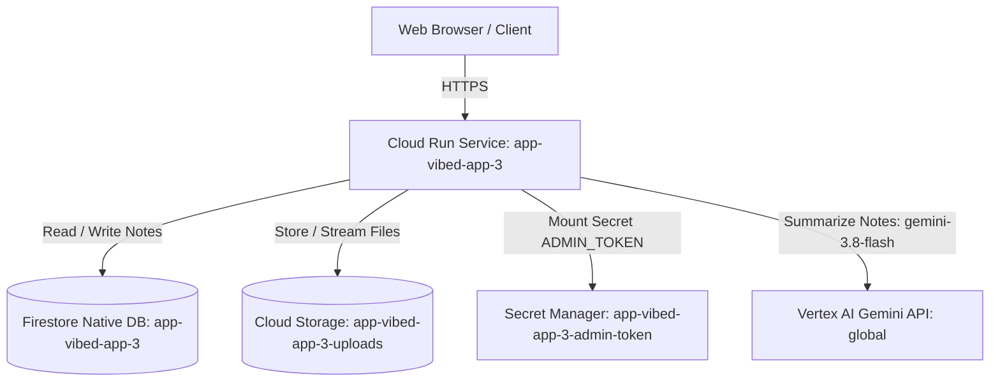

# Production Infrastructure Design: app-vibed-app-3

## Context
The application `vibed-app-3` is a full-stack note-taking platform comprising an Express.js backend and a Vite-built React frontend bundled into a single Docker image. In its prototype state, the application retained note records in an in-memory array (`let notes = []`), saved uploaded media to a local `uploads/` directory on disk, executed shell commands to create zip archives (`execFile("zip", ...)`), and invoked Gemini summaries using an API key with model `gemini-2.5-flash`.

This design establishes production readiness on Google Cloud. The application runs on Google Cloud Run with scale-to-zero capabilities, persists note documents in a dedicated Firestore Native database (`app-vibed-app-3`), durably stores uploaded media and archives in a Google Cloud Storage bucket (`app-vibed-app-3-uploads`), transitions AI summarization to Vertex AI using `gemini-3.8-flash` authenticated through the platform runtime service account, and manages sensitive authorization tokens through Secret Manager.

## Architecture

The architecture provisions Google Cloud resources strictly within project `vibe2prod-509620` and region `us-central1`. The single Cloud Run service `app-vibed-app-3` serves both static React frontend assets and backend API endpoints over HTTPS.

### Components
1. **Cloud Run Service (`app-vibed-app-3`)**:
   - Serves React UI assets from `dist/` and handles API requests (`/api/notes`, `/api/summarize`, `/api/upload`, `/api/files/:name`, `/api/export`, `/health`).
   - Sized for cost-effectiveness: 1 vCPU, 512MiB RAM, scaling between 0 and 5 instances, handling up to 80 concurrent requests per instance.
   - Configured with `invoker_iam_disabled = true` and `ingress = INGRESS_TRAFFIC_ALL` to satisfy org policies forbidding `allUsers` IAM bindings while maintaining public accessibility.
2. **Firestore Native Database (`app-vibed-app-3`)**:
   - Created as a dedicated Firestore Native database in `us-central1` separate from the default project database.
   - Stores persistent note documents in collection `notes`.
3. **Cloud Storage Bucket (`app-vibed-app-3-uploads`)**:
   - Regional GCS bucket in `us-central1` with uniform bucket-level access and enforced public access prevention.
   - Stores user-uploaded media files and acts as the source for zip archive exports.
4. **Secret Manager (`app-vibed-app-3-admin-token`)**:
   - Houses the administrative token generated via Terraform `random_password`.
   - Injected into Cloud Run as the environment variable `ADMIN_TOKEN`.
5. **Vertex AI Integration**:
   - Invokes model `gemini-3.8-flash` in location `global` via `@google/genai` using the runtime service account's default credentials.

## Data Flow

1. **Frontend & Health Routing**:
   - HTTP GET requests to `/` or static assets serve compiled React bundles from local container memory.
   - Cloud Run startup and liveness probes target `GET /health`, returning HTTP 200 with `{ status: "ok" }` without accessing external services.
2. **Note Management**:
   - `GET /api/notes`: Reads all documents from the `notes` collection in Firestore database `app-vibed-app-3` and returns an array of `{ id, text }`.
   - `POST /api/notes`: Validates input text (non-empty string <= 5000 chars), writes document `{ id, text, createdAt }` to Firestore database `app-vibed-app-3`, and returns HTTP 201.
   - `DELETE /api/notes/:id`: Checks `x-admin-token` header against the mounted `ADMIN_TOKEN` secret. On match, deletes the corresponding document in Firestore database `app-vibed-app-3` and returns `{ ok: true }`.
3. **AI Summarization**:
   - `POST /api/summarize`: Fetches current note texts from Firestore database `app-vibed-app-3`, constructs the summarization prompt, and dispatches a content generation request to Vertex AI model `gemini-3.8-flash` using service account ambient credentials. Returns `{ summary: response.text }`.
4. **File Upload & Download**:
   - `POST /api/upload`: Multer processes file in memory (`multer.memoryStorage()`), generates a secure random filename, streams buffer to Cloud Storage bucket `app-vibed-app-3-uploads`, and returns `{ name: filename }`.
   - `GET /api/files/:name`: Verifies file exists in `app-vibed-app-3-uploads`, sets content type, and streams object data to client response.
5. **Export Archive**:
   - `GET /api/export?name=<archive_name>`: Lists objects in Cloud Storage bucket `app-vibed-app-3-uploads`, dynamically pipes each object stream into an `archiver` zip stream, and transmits the resulting zip archive to the client response, avoiding local shell commands and disk constraints.

## Security

- **Public Access Compliance**: The organization policy prohibits IAM bindings to `allUsers` or `allAuthenticatedUsers`. Public accessibility is accomplished by setting `invoker_iam_disabled = true` with `ingress = "INGRESS_TRAFFIC_ALL"` on the Cloud Run service resource.
- **Least-Privilege IAM**: Runtime service account `vibe2prod-app-runtime@vibe2prod-509620.iam.gserviceaccount.com` is granted only necessary permissions:
  - `roles/datastore.user` scoped by CEL condition strictly to `projects/vibe2prod-509620/databases/app-vibed-app-3`.
  - `roles/storage.objectViewer` scoped directly to bucket `app-vibed-app-3-uploads` to read and list stored objects.
  - `roles/storage.objectCreator` scoped directly to bucket `app-vibed-app-3-uploads` to upload new files without admin privileges.
  - `roles/secretmanager.secretAccessor` scoped directly to secret `app-vibed-app-3-admin-token`.
  - Vertex AI access is already granted via pre-existing `roles/aiplatform.user`.
- **Secret Protection**: The `ADMIN_TOKEN` value is created using Terraform `random_password`, stored in Secret Manager, and exposed to the container exclusively as an environment variable reference.
- **Storage Hardening**: The GCS bucket enforces uniform bucket-level access (`uniform_bucket_level_access = true`) and blocks public access (`public_access_prevention = "enforced"`).
- **Container Security**: Container runs as non-root user `1000:1000` on a minimal `node:20.18.1-slim` base, with Helmet security headers enabled.

## IAM

| Principal | Role | Resource | Condition | Justification |
| :--- | :--- | :--- | :--- | :--- |
| `serviceAccount:vibe2prod-app-runtime@vibe2prod-509620.iam.gserviceaccount.com` | `roles/datastore.user` | `projects/vibe2prod-509620` | `resource.name == "projects/vibe2prod-509620/databases/app-vibed-app-3"` | Read/write access to note documents in the dedicated Firestore database. |
| `serviceAccount:vibe2prod-app-runtime@vibe2prod-509620.iam.gserviceaccount.com` | `roles/storage.objectViewer` | `app-vibed-app-3-uploads` | None | Read and list uploaded objects for downloads and zip archive exports. |
| `serviceAccount:vibe2prod-app-runtime@vibe2prod-509620.iam.gserviceaccount.com` | `roles/storage.objectCreator` | `app-vibed-app-3-uploads` | None | Write new uploaded objects to the Cloud Storage bucket without administrative privileges. |
| `serviceAccount:vibe2prod-app-runtime@vibe2prod-509620.iam.gserviceaccount.com` | `roles/secretmanager.secretAccessor` | `app-vibed-app-3-admin-token` | None | Allows container to resolve the admin token secret value at startup. |

*Note: The runtime service account already possesses `roles/aiplatform.user` at the project level.*

## Configuration

### Environment Variables

| Name | Source | Purpose | Value |
| :--- | :--- | :--- | :--- |
| `NODE_ENV` | literal | Enforces Node.js production performance mode | `production` |
| `PORT` | literal | Port Express server listens on, matched to container_port | `3000` |
| `ALLOWED_ORIGINS` | literal | Permits browser clients to access REST endpoints | `*` |
| `GOOGLE_CLOUD_PROJECT` | literal | GCP project identifier for Firestore and Vertex AI | `vibe2prod-509620` |
| `FIRESTORE_DATABASE_ID` | literal | Specifies the isolated Firestore database instance | `app-vibed-app-3` |
| `GCS_BUCKET_NAME` | literal | Cloud Storage bucket storing file uploads | `app-vibed-app-3-uploads` |
| `ADMIN_TOKEN` | secret | Header secret required for `DELETE /api/notes/:id` | Referenced from `app-vibed-app-3-admin-token` |

### Secrets

| Secret Name | Env Var | Purpose | Generation Source |
| :--- | :--- | :--- | :--- |
| `app-vibed-app-3-admin-token` | `ADMIN_TOKEN` | Authorizes administrative note deletion requests | `random_password` (32 characters, alphanumeric) |

## Cost Drivers

Cost drivers for this service are modeled by usage volume and quantities:
1. **Cloud Run Compute & Memory**: vCPU-seconds and memory-seconds consumed during request processing. With `min_instance_count = 0`, instances scale to zero during idle periods, incurring charges only during active handling of ~30,000 monthly requests (including probes) averaging ~0.15s duration.
2. **Cloud Storage**: Storage volume of ~1.5 GB for uploaded media, alongside Class A write/list operations (~500/month) and Class B read operations (~2,000/month).
3. **Firestore Database**: Storage capacity for ~0.1 GB of note documents, with ~15,000 document read operations and ~2,500 document write/delete operations per month.
4. **Vertex AI Summarization**: Monthly volume of ~500 content generation calls against `gemini-3.8-flash` with an average of 1,200 input tokens and 250 output tokens per summary.
5. **Secret Manager**: Volume of ~200 secret access calls occurring upon container cold starts.
6. **Network Egress**: Outbound data transfer for ~30,000 responses averaging ~20 KB each (~0.6 GB total egress).

## Operations and Observability

- **Health Monitoring**: Dedicated probe route `GET /health` enables Cloud Run startup (evaluated every 5s after 2s delay) and liveness probes (evaluated every 15s) to guarantee zero-downtime routing without loading backing databases.
- **Structured Logging**: Express application logs errors and operational metrics directly to standard output/error, captured automatically in Cloud Logging with trace context.
- **Alerting Recommendations**: Although budget alerts require billing account permissions outside this pipeline, it is recommended that administrators configure a Cloud Monitoring alerting policy via the GCP console targeting container restart counts (`run.googleapis.com/container/restarts > 3`) and elevated 5xx HTTP response rates.

## Rollout

1. **Terraform Apply**:
   - Provision `random_password.app-vibed-app-3-admin-token-pass`.
   - Create Secret Manager secret `app-vibed-app-3-admin-token` and version.
   - Provision Firestore Native database `app-vibed-app-3` in `us-central1`.
   - Provision Cloud Storage bucket `app-vibed-app-3-uploads` in `us-central1`.
   - Establish IAM role bindings for `roles/datastore.user`, `roles/storage.objectViewer`, `roles/storage.objectCreator`, and `roles/secretmanager.secretAccessor`.
   - Deploy Cloud Run service `app-vibed-app-3` with container configuration, environment variables, probes, and secret references.
2. **Verification & Smoke Tests**:
   - Verify probe health: `curl -f https://<service-url>/health`.
   - Test note creation: `POST /api/notes` with JSON payload.
   - Test note retrieval: `GET /api/notes`.
   - Test summarization: `POST /api/summarize` verifying Vertex AI response.
   - Test file upload: `POST /api/upload` verifying persistence in GCS.
   - Test admin deletion: `DELETE /api/notes/<id>` with invalid and valid `x-admin-token`.

## Risks

- **Cold Start Latency**: Scaling to zero can introduce a 1-3 second latency spike on initial cold starts. Mitigated by keeping container image size slim, minimizing imports, and setting fast startup probes.
- **Large Zip Exports**: Exporting numerous large files simultaneously could strain container memory. Mitigated by streaming files directly through Node.js streams via `archiver` rather than buffering full archives in memory.
- **Vertex AI Regional Outage / Quota**: Vertex AI Gemini 3.8 Flash is accessed via location `global`. If request limits or network throttles occur, exponential backoff handling in the application minimizes user disruption.

## Required Code Changes

1. **Dependencies (`package.json`)**:
   - Add `@google-cloud/firestore` (`^7.11.0`), `@google-cloud/storage` (`^7.15.0`), and `archiver` (`^7.0.1`).
2. **Firestore Integration (`server.js`)**:
   - Initialize Firestore client targeting database ID `app-vibed-app-3`.
   - Replace in-memory array manipulation in `GET /api/notes`, `POST /api/notes`, and `DELETE /api/notes/:id` with Firestore document operations against the `notes` collection.
3. **Vertex AI Summarization (`server.js`)**:
   - Update `GoogleGenAI` initialization to `{ vertexai: true, project: process.env.GOOGLE_CLOUD_PROJECT || 'vibe2prod-509620', location: 'global' }`.
   - Change model target in `POST /api/summarize` to `gemini-3.8-flash` and aggregate notes from Firestore.
   - Remove dependency on `process.env.GEMINI_API_KEY`.
4. **Cloud Storage & Zip Archiving (`server.js`)**:
   - Replace multer disk storage with `multer.memoryStorage()`.
   - Write uploaded files directly to GCS bucket `app-vibed-app-3-uploads` and stream file reads from GCS in `GET /api/files/:name`.
   - Rewrite `GET /api/export` to stream files from GCS into an `archiver` zip stream piped to the response, removing `child_process.execFile("zip", ...)`.
5. **Health Check Route (`server.js`)**:
   - Add endpoint `GET /health` returning `{ status: "ok" }` with HTTP 200 for probes.
6. **CORS Configuration (`server.js`)**:
   - Ensure CORS middleware accepts wildcard `*` origins to permit communication from browser clients accessing the Cloud Run service URL.

---
Written by the Vibe2Prod Architect agent; independent critic approved after 2 round(s). A human approves before Terraform is written.
