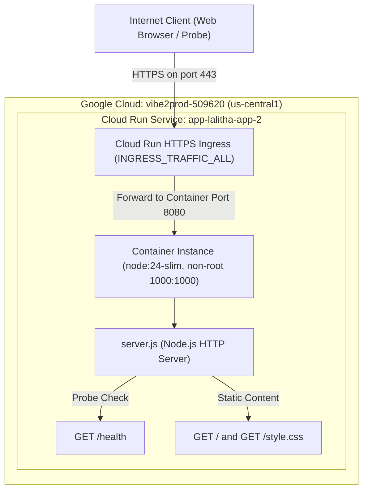

# Production Architecture Design: app-lalitha-app-2

## Context
`lalitha-app-2` is a lightweight Node.js web application using the native `node:http` module to serve static assets (`index.html`, `style.css`) and a JSON health check endpoint (`/health`). The codebase has already been hardened with path-traversal protections, restrictive HTTP method handling (GET and HEAD only), safe URL decoding, and robust security headers (CSP, HSTS, X-Content-Type-Options, etc.). The container runs as an unprivileged user (`UID:GID 1000:1000`). This document outlines how the service is deployed to Google Cloud Run in project `vibe2prod-509620`, region `us-central1`.

## Architecture

The application is deployed as a single Google Cloud Run service (`app-lalitha-app-2`) running in `us-central1`. Because the service contains no stateful database or external API dependencies, it scales to zero when idle and serves all requests directly from the immutable container filesystem.

## Data Flow

1. **User Request (Static Assets)**:
   - An external browser requests `GET /` or `GET /style.css` over HTTPS.
   - Cloud Run ingress terminates TLS and forwards the request to container port `8080`.
   - `server.js` parses and sanitizes the requested pathname, validates that the path resolves within the local `public/` directory, and streams the file with appropriate MIME type and security headers.

2. **Health Check Probes**:
   - Cloud Run startup and liveness probes issue `GET /health`.
   - `server.js` intercepts `/health` in memory without filesystem or network access, immediately returning `{"status":"ok"}` with HTTP 200.

## Security

- **Public Access Model**: The organization policy prohibits IAM bindings to `allUsers` and `allAuthenticatedUsers`. Public web reachability is enabled by setting `invoker_iam_disabled = true` and `ingress = "INGRESS_TRAFFIC_ALL"` on `google_cloud_run_v2_service` without creating forbidden IAM bindings.
- **Least Privilege Identity**: The service executes under the pre-existing shared runtime service account `vibe2prod-app-runtime@vibe2prod-509620.iam.gserviceaccount.com`. Because the application requires no database, cloud storage, or secrets, no additional IAM privileges are granted.
- **Container Isolation**: The container executes as non-root user `1000:1000`. The root filesystem is read-only at runtime except for ephemeral `/tmp`.
- **HTTP Hardening**: Native response headers include Content Security Policy (`default-src 'self'`), `Strict-Transport-Security`, `X-Content-Type-Options: nosniff`, `X-Frame-Options: DENY`, and explicit method checking allowing only `GET` and `HEAD`.

## IAM

| Principal | Role | Resource | Condition | Reason |
| :--- | :--- | :--- | :--- | :--- |
| `serviceAccount:vibe2prod-app-runtime@vibe2prod-509620.iam.gserviceaccount.com` | Baseline (no additional roles) | N/A | None | The service does not interact with any GCP APIs, Cloud Storage, or Firestore. Invoker permissions are managed via `invoker_iam_disabled = true`. |

## Configuration

### Environment Variables

| Variable Name | Source | Value | Purpose |
| :--- | :--- | :--- | :--- |
| `NODE_ENV` | Literal | `production` | Enables production optimizations in the Node.js runtime. |
| `PORT` | Runtime | `8080` | Specifies the TCP port the HTTP server binds to (injected by Cloud Run). |

### Secrets

No secrets or API keys are required for this application.

## Cost Drivers

- **Cloud Run Compute**: vCPU-seconds and Memory (GiB-seconds) consumed only while active requests or health checks are executing.
- **Cloud Run Requests**: Metered per individual HTTP request count.
- **Network Egress**: Outbound data transfer for HTML and CSS payloads (typically < 3 KB per page load).
- Cost is kept to a minimal baseline by setting `min_instance_count = 0` (scale-to-zero) and `max_instance_count = 2`.

## Operations and Observability

- **Health Checks**: Startup and liveness probes query `/health` on port 8080 with a 3-second period and 10-second timeout.
- **Logging**: Server lifecycle and uncaught exceptions log to `stdout`/`stderr` and are captured by Google Cloud Logging under the Cloud Run service resource.
- **Metrics**: Standard Cloud Run metrics in Google Cloud Monitoring provide request count, latency (p50, p95, p99), container CPU/memory utilization, and instance count.
- **Budget Alert Recommendation**: An operational budget alert should be configured in Cloud Billing covering project `vibe2prod-509620` with alert thresholds set at 50%, 80%, and 100% of expected monthly budget.

## Rollout

1. Terraform creates `google_cloud_run_v2_service.app-lalitha-app-2` referencing `var.image`.
2. Cloud Run initiates traffic routing to the initial revision upon successful startup probe completion at `/health`.
3. Subsequent updates execute zero-downtime rolling deployments using Cloud Run's native revision traffic management.

## Risks

- **Cold Starts**: When scaling up from 0 instances after periods of inactivity, initial requests may take 1 to 2 seconds to initialize the Node.js container.
- **Unauthenticated Endpoint**: The web service is publicly accessible without user authentication; DDoS or heavy traffic is bounded by `max_instance_count = 2`.

## Required Code Changes

None. The code already includes an in-memory `/health` endpoint, standard port bindings via `process.env.PORT`, appropriate security headers, graceful termination handlers (`SIGTERM`/`SIGINT`), and Dockerfile non-root execution.

---
Written by the Vibe2Prod Architect agent; independent critic approved after 1 round(s). A human approves before Terraform is written.
