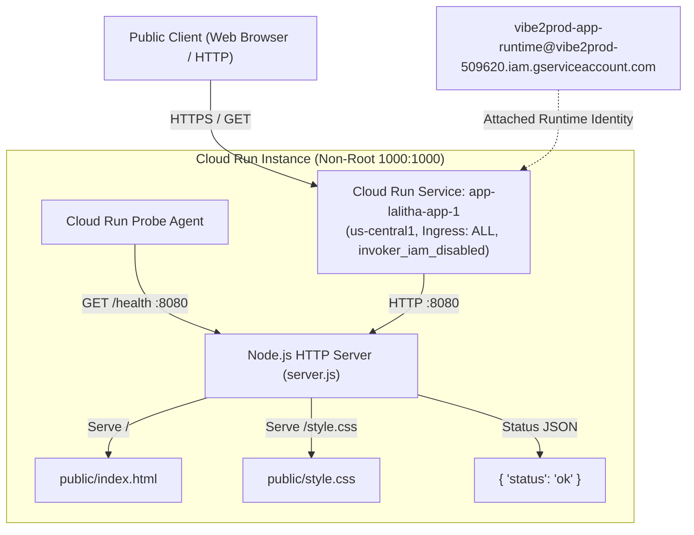

# Production Architecture Design: app-lalitha-app-1

## Context
`lalitha-app` is a minimal, hardened Node.js web server that serves static frontend assets (`public/index.html`, `public/style.css`) and exposes a `/health` endpoint for readiness and liveness checks. The application is completely stateless, has no external runtime dependencies or database connections, and performs all request handling via Node.js native HTTP and file system modules.

This document outlines the production architecture to run `lalitha-app` on Google Cloud in project `vibe2prod-509620`, region `us-central1`. The infrastructure is fully managed by Terraform, adhering strictly to platform security policies, cost optimization principles, and operational standards.

## Architecture
The architecture consists of a single Google Cloud Run service (`google_cloud_run_v2_service`) named `app-lalitha-app-1`. Ingress traffic is accepted from the public internet without violating organization policies against `allUsers` IAM bindings by enabling `invoker_iam_disabled = true` alongside `ingress = "INGRESS_TRAFFIC_ALL"`.

The service scales down to zero when idle (`min_instance_count = 0`) to eliminate unnecessary compute consumption, with an upper boundary of 5 instances (`max_instance_count = 5`) to prevent runaway scaling during traffic anomalies. Each instance runs the containerized application as an unprivileged numeric user (`1000:1000`) and executes under the platform runtime service account `vibe2prod-app-runtime@vibe2prod-509620.iam.gserviceaccount.com`.

## Data Flow
1. **User Request Path:**
   - A client establishes an HTTPS connection to the Cloud Run endpoint.
   - Cloud Run terminates TLS and forwards the HTTP request to the container on port `8080`.
   - `server.js` verifies the HTTP method, allowing only `GET` and `HEAD` requests. Any `POST`, `PUT`, or `DELETE` receives a `405 Method Not Allowed` response.
   - The URL path is sanitized and verified against null bytes and directory traversal attacks (`filePath.startsWith(PUBLIC_DIR + path.sep)`).
   - The requested file is read asynchronously from the container's read-only file system (`readFile`) and returned to the client along with standard security headers (`Content-Security-Policy`, `X-Content-Type-Options`, `X-Frame-Options`, `Referrer-Policy`, `Permissions-Policy`, `Cross-Origin-Opener-Policy`, `Cross-Origin-Resource-Policy`).
2. **Health Check Probes:**
   - Cloud Run startup and liveness probes send HTTP `GET` requests to `/health`.
   - The server matches `/health` immediately and returns HTTP `200 OK` with payload `{"status":"ok"}` without touching disk or external systems.
3. **State Management:**
   - The service is entirely stateless. Static files are bundled directly into the container image during the build stage. No local disk persistence or in-memory session stores are utilized, ensuring seamless multi-instance scaling and restart resilience.

## Security
- **Public Access & Org Policy Compliance:** Google Cloud Organization policies forbid granting IAM roles (such as `roles/run.invoker`) to `allUsers` or `allAuthenticatedUsers`. To allow public access legitimately, Cloud Run's native `invoker_iam_disabled = true` attribute is set on `app-lalitha-app-1`, paired with `INGRESS_TRAFFIC_ALL`.
- **Least Privilege Identity:** The Cloud Run service is bound to the pre-existing runtime identity `vibe2prod-app-runtime@vibe2prod-509620.iam.gserviceaccount.com`. Because the application does not interact with any Cloud Storage buckets, Secret Manager secrets, Firestore databases, or Vertex AI APIs, zero additional IAM roles or permissions are required or granted.
- **Container Hardening:** The container runs with `USER 1000:1000`, precluding privilege escalation within the container environment. The underlying operating system is `node:24-slim` with minimal package surface area.
- **Application Defenses:** `server.js` strictly enforces path containment within `PUBLIC_DIR`, rejects null bytes (`\0`), and serves hardened HTTP security headers on all responses.

## IAM

| Principal | Role | Resource | CEL Condition | Reason |
| :--- | :--- | :--- | :--- | :--- |
| `serviceAccount:vibe2prod-app-runtime@vibe2prod-509620.iam.gserviceaccount.com` | *(None)* | `app-lalitha-app-1` | *(None)* | Runtime service account attached to Cloud Run; no supplementary permissions required as the app uses no GCP APIs. |

*Note: No IAM policy binding for `allUsers` is created; public ingress is achieved via `invoker_iam_disabled = true`.* 

## Configuration

### Environment Variables
| Name | Value | Source | Purpose |
| :--- | :--- | :--- | :--- |
| `PORT` | `8080` | `runtime` | Injected by Cloud Run to define the HTTP listening port. |
| `NODE_ENV` | `production` | `literal` | Enables production mode optimizations in the Node.js runtime. |

### Secrets
*No secrets are required for this application.* 

## Cost Drivers
The infrastructure costs for `app-lalitha-app-1` are driven exclusively by the following quantifiable operational metrics:
- **Cloud Run vCPU & Memory Seconds:** Sized to 1 vCPU and 512 MiB RAM. With `cpu_idle = true` enabled and `min_instance_count = 0`, compute charges accrue only during active request processing. At ~10 ms processing time per request, compute consumption is negligible.
- **Request Invocations:** Estimated at 10,000 requests per month (including external user requests and Cloud Run probe traffic).
- **Network Egress:** An average payload of 2.0 KB per request generates approximately 20 MB of network data transfer per month.
- **Zero Ancillary Costs:** There are no storage buckets (0 GB), no databases (0 reads/writes), no secret accesses (0 accesses), and no AI model calls (0 Vertex AI invocations).

## Operations and Observability
- **Health Monitoring:**
  - Startup probe: Configured on path `/health`, initial delay of 2 seconds, checking every 5 seconds with a failure threshold of 3.
  - Liveness probe: Configured on path `/health`, period of 15 seconds, timeout of 2 seconds, failure threshold of 3.
- **Cloud Logging:** The Node.js application outputs startup diagnostics to `stdout` (`server.listen`), which are automatically ingested into Cloud Logging with container revision and instance metadata.
- **Cloud Monitoring:** Cloud Run provides out-of-the-box telemetry for request count, response latency distributions (p50, p95, p99), HTTP status codes (2xx, 4xx, 5xx), and container instance count.
- **Budget & Alerts:** Because the pipeline lacks billing-account permissions to create Terraform `google_billing_budget` resources, project administrators should set up a standard billing budget alert in the Google Cloud Billing console and configure a Cloud Monitoring alert policy on HTTP 5xx error spikes (> 1% over a 5-minute rolling window).

## Rollout
1. The deployment pipeline builds the container image using the project's Dockerfile and supplies the image digest to Terraform via `var.image`.
2. Terraform creates/updates `google_cloud_run_v2_service.app-lalitha-app-1` in `us-central1`.
3. Cloud Run executes the startup probe against `/health` on the newly provisioned container instance.
4. Once the probe succeeds, Cloud Run routes 100% of ingress traffic to the new revision.
5. Rollbacks can be executed instantaneously by reverting to the prior revision in Cloud Run.

## Risks
- **Traffic Surges & Concurrency Limits:** Sudden bursts of traffic could cause Cloud Run to scale to its maximum of 5 instances. This is mitigated by configuring `max_instance_request_concurrency = 80`, allowing a single instance to handle up to 80 concurrent static file transfers.
- **Cold Starts:** Scaling to zero can introduce a cold-start delay of 1 to 2 seconds on the initial request. Because this is a lightweight static server without database handshakes, cold start overhead remains well within acceptable bounds.
- **Public Surface Exposure:** Because the service is open to the public internet, malicious scanners may generate unsolicited traffic. This is mitigated by strict HTTP method gating (GET/HEAD only), path boundary enforcement, and hard limits on instance scaling.

## Required Code Changes
No code modifications are required. The current codebase already satisfies all production requirements:
- Listens dynamically on `process.env.PORT` with an 8080 fallback.
- Implements a dedicated, lightweight `/health` check returning HTTP 200 JSON.
- Correctly handles graceful termination signals (`SIGTERM`, `SIGINT`).
- Strictly operates statelessly with pre-packaged assets in `public/`.

---
Written by the Vibe2Prod Architect agent; independent critic approved after 1 round(s). A human approves before Terraform is written.
